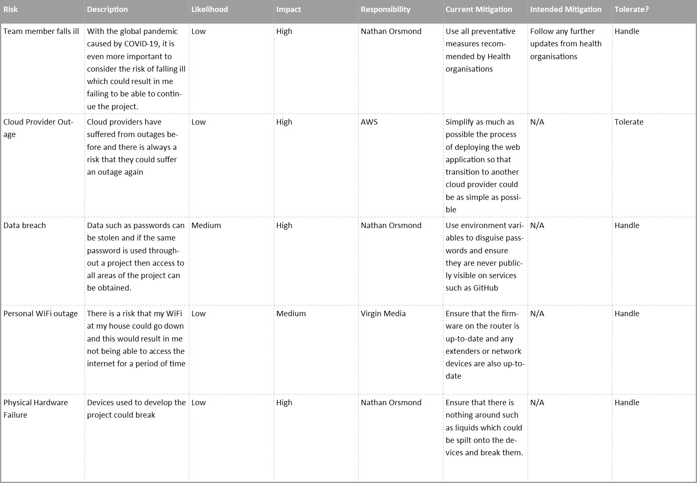

# QAC SFIA2 Project
As part of this project, it is my responsibility to use the required tools to deploy the pre-developed web application given to us. Within this README I will be explaining the tools used to aid me in deploying the application

## Risk Assessment
Risks are a major part of every project and something that 
needs to be addressed. Each project has its own potential risks,
and mine is no exception. Because of this, I have analysed risks
which cover the whole scope of the project as to ensure that
each area has precautions in place to ensure that the risks are
mitigated, not only in specific areas but as a whole for the project.

Within my risk assessment I will be using different levels to classify the risks
in given areas, these are as follows:
* Likelihood
    * High - This means that chance of this risk occurring is very likely and
    that there are not any or very little mitigating factors in place to prevent
    this risk from occurring.
    * Medium - This means that there is a chance of the risk occurring but there
    are mitigating factors in place to prevent this.
    * Low - This means that there is little chance of the risk occurring.
* Impact
    * High - The risk can cause a severe or catastrophic failure of the site
    resulting in no access or a malfunction.
    * Medium - The risk can cause a malfunction on the site but won't result
    in any major impacts such as loss of data.
    * Low - The risk can't cause any major impact because measures are in
    place to recover from this risk.
* Tolerance
    * Tolerate - No action taken because the preventative measures in place
    are sufficient to manage the consequences of the risk.
    * Handle - Action taken to mitigate the consequences of the risk.

## Jira Software
The Jira Software allowed me to create a Kanban board which contained a backlog of tasks and user stories which were each
assigned to an "epic" which helped to group the tasks and user stories up into more clear sections. Each user story could be
ranked by importance and this allowed me to set a level of prioritisation for the tasks.

Link to Kanban board: [Kanban Board](https://npo1.atlassian.net/secure/RapidBoard.jspa?rapidView=3&view=planning&selectedIssue=PRAC-10&issueLimit=100)

## Version Control
The version control system I used was git and more specifically I used GitHub. Git is an extremely useful 
tool that allowed me to create any number of branches which I could push my code too. Regular commits allowed me to have a large number of
"waypoints" so that if I had an error in my latest commit, I could revert back to previous working build and push on from there.

## Docker and Docker Compose
Docker and Docker-Compose are both tools used for Containerisation, these tools are very useful for when it comes to deploying applications using different environments. You could start up a fresh VM and only install Docker and Docker-Compose and then use this to start a Nginx image without having it installed on the VM. This meant that multiple enviornments could be ran without need for installation of the seperate packages. Another useful feature was the ability to push my local images to my dockerhub account and store them as repositories so that I could then pull down the latest version of my image and spin up containers using these latest versions.

## Jenkins
For the Continuous Integration of my project I used Jenkins. I used Jenkins to create a pipeline project which used a webhook from my GitHub repository and when this webhook was activated the pipeline would be started. Jenkins would SSH onto my test environment and perform all the necessary tests before then SSH'ing onto the live environment and deploying the application for anybody to access.

## AWS EC2 && RDS
The cloud provider I used for this project was AWS. I used AWS for both the EC2/VM instances and the DB/RDS instances. The EC2 instances on AWS are highly customisable and scalable which meant that I could tailor the instances to my needs and ensure that there was no bottleneck for my web application. 

## Ansible
For this project I used Ansible to configure Jenkins and a Jenkins user on an EC2 instance and then print out the initial admin password, this simplified and streamlined the process of setting up Jenkins on a VM, I no longer needed to SSH onto a VM myself and configure it.

## Terraform
Terraform is a tool I used to spin up my testing environment including the test database on AWS RDS as well as the production RDS instance too. This tool can be used to configure the security groups and VPC's and allows for a large amount of configuration.

## Nginx
Within the project I used Nginx to act as a reverse proxy, this meant that the only port exposed to the open internet was port 80 as opposed to having all of my services open on all ports such as 5000, 5001 and 3306 which would have provided multiple channels for a potential attack on my web application. Having just one port opened added a layer of security for my web application.

## Kubernetes
Kubernetes serves as the container orchestration tool, within this project it's use is to provide the live environment using the latest images from my Docker hub account.